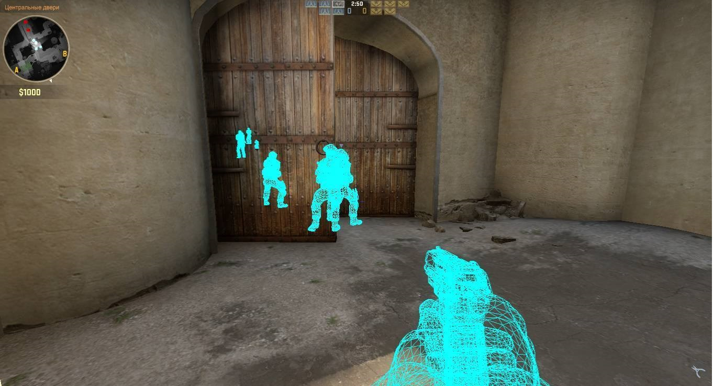

# Wallhacks

### "zomg wtf y u toggle dem wall hacks bro."
**- Some teenager in 2005**

Wallhacks is a tool to scan for common IP cameras on a local network. It does this by proiscuous packet search: scouring a local subnet for common web portals used to manage IP cameras. Think of it like Shodan's crawler, but instead of something more subtle like a nmap stealth scan it kicked in the door like the Kool-Aid guy and yelled "OH YEAH!"

If a camera is found, Wallhacks reports on the location of the IP and gives the default administrator login for that camera. What you do from there is up to you.

### Vendor list

Wallhacks maintains a list of common IP camera vendors and their default admin credentials at *Camera-Vendors.csv.* By default, Wallhacks will use this list for its scan. But in future versions Wallhacks may allow for users to supply a .csv with a similar schema. 

### Source Code

*Netscan.cs*: This class contains the pertinent networking code for Wallhacks, as well as ways to run Wallhacks for different UX. 

*Program.cs*: This class contains test code to run Wallhacks as a CLI file for any .NET compatible system. 

*Spinner.cs*: A simple CLI spinner based on code that was too hot to not pull from StackOverflow. Thank you [SomeGuy](https://stackoverflow.com/users/910348/thisguy)

### License

Wallhacks and its contents are licensed under the [MPL License](https://www.mozilla.org/en-US/MPL/2.0/). 
